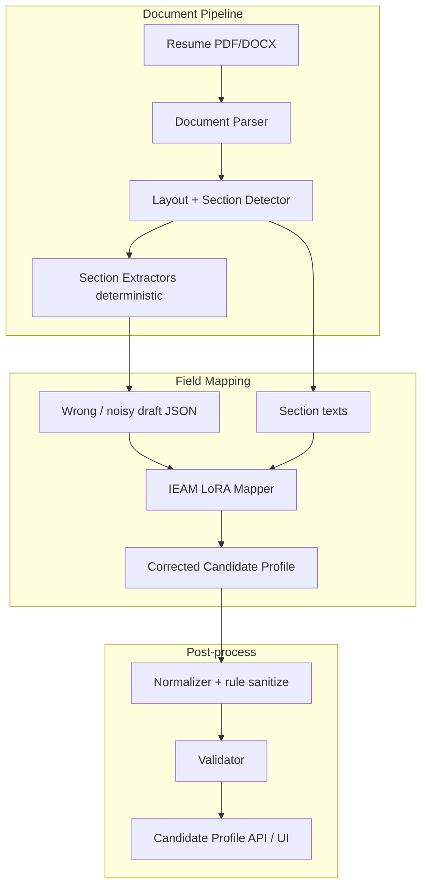
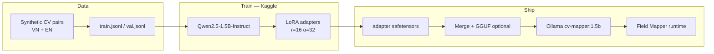
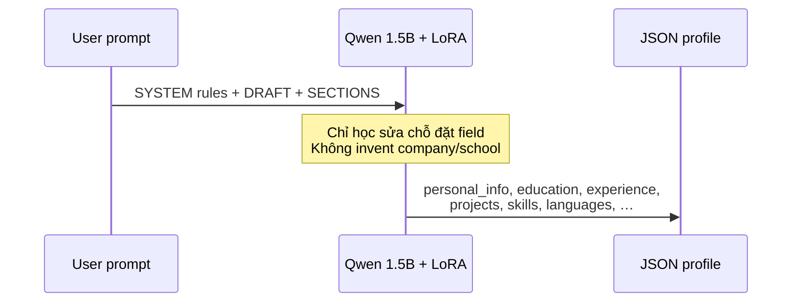

# IEAM — Intelligent CV Field Mapper

> Fine-tune **Qwen2.5-1.5B-Instruct** (LoRA) để đặt đúng từng thông tin CV vào JSON schema — tiếng Việt & English.  
> Train trên **Kaggle GPU (T4 / A100)** · suy luận local qua **Ollama**.

```text
WRONG DRAFT                    SECTIONS TEXT                 CORRECT PROFILE
─────────────                  ─────────────                 ───────────────
company = "Backend Dev"   +    [experience] Công ty ABC  →   company = "Công ty ABC"
position = "Công ty ABC"       Backend Developer             position = "Backend Developer"
awards = [PTIT, GPA 3.4]       [awards] Top 10 ICPC          education = [{school: PTIT…}]
languages = [Python]                                         languages = [English…]
```

---

## Vì sao cần model này?

Parser deterministic (rule / regex) thường **đúng chữ nhưng sai ngăn kéo**:

| Lỗi hay gặp | Hậu quả |
|-------------|---------|
| Đảo `company` ↔ `position` | job title thành tên công ty |
| Đổ trường / GPA vào `awards` | học vấn biến thành thành tích |
| Skill `Language: Python` → `languages` | ngoại ngữ dính ngôn ngữ lập trình |
| Gộp 3 job vào 1 object | experience thiếu / lẫn |

**IEAM** học nhiệm vụ hẹp: *đã có draft + text section → sửa placement*, không bịa thêm fact. Nhỏ (1.5B + LoRA ~1%) nên chạy ổn trên consumer GPU / Ollama CPU sau khi export.

---

## Kiến trúc tổng thể

### Trong hệ Interview Processing



### Vòng đời train → deploy



### Bên trong một bước SFT



---

## Output schema (Target JSON)

Model được dạy trả về object với các khóa:

| Key | Ý nghĩa |
|-----|---------|
| `personal_info` | name, email, phone, location, job_title, links, summary |
| `education[]` | school, major, degree, year, gpa |
| `experience[]` | **company**, **position**, time, achievements |
| `projects[]` | name, technologies, responsibilities, github |
| `skills` | explicit + categories (`Language` = lập trình) |
| `languages[]` | chỉ ngoại ngữ nói (English, Japanese, …) |
| `certificates[]` / `awards[]` / `activities[]` | đúng loại nội dung |

Rule cứng trong system prompt (`prompts.py`): không đưa Python vào `languages`, không đưa GPA vào `awards`, tách nhiều job thành nhiều phần tử.

---

## Cấu trúc repo

```text
cv-mapper-finetune/
├── data/
│   ├── README.md             # GIẢI THÍCH data (đọc file này)
│   ├── train.jsonl           # ~9000 mẫu train (~70MB+)
│   ├── val.jsonl             # ~1000 mẫu val
│   └── manifest.json         # thống kê
├── generate_dataset.py       # sinh / tăng thêm data
├── train_lora.py
…
```

**Data không phải PDF.** Mỗi dòng `train.jsonl` là 1 bài chat: draft JSON sai + text section → JSON đúng. Mở rộng folder `data/` trên Kaggle Input để thấy file.

Tăng data bất cứ lúc nào:

```bash
python generate_dataset.py --n 20000
```

Mỗi dòng JSONL dạng chat:

```json
{
  "messages": [
    {"role": "system", "content": "You fix CV JSON field placement..."},
    {"role": "user", "content": "Fix this CV draft...\nDRAFT:{...}\nSECTIONS:..."},
    {"role": "assistant", "content": "{...correct profile JSON...}"}
  ]
}
```

`generate_dataset.py` cố ý inject lỗi: swap title, merge jobs, edu→awards, prog lang→languages — để model học **sửa**.

---

## Siêu tham số mặc định

| Setting | Giá trị | Ghi chú |
|---------|---------|---------|
| Base | `Qwen/Qwen2.5-1.5B-Instruct` | Hugging Face |
| LoRA r / α | 16 / 32 | ~1.18% trainable params |
| Target modules | q,k,v,o,gate,up,down | |
| max_seq_length | 2048–4096 | JSON dài cần ctx |
| Epochs | 2 | |
| A100 | bf16, batch 4, accum 4 | |
| T4 | fp16, batch 2, accum 8 | Khuyến nghị trên Kaggle free |
| P100 | **Không dùng** | sm_60 không tương thích PyTorch mới |

---

## Train trên Kaggle (chi tiết)

### Chuẩn bị

1. Repo này → nén / push GitHub → **Add Data = Dataset** (source code + `data/`), **không** tạo Kaggle Model GGUF.
2. New Notebook · **Accelerator: GPU T4** (hoặc A100) · Internet **ON**.
3. Tránh Tesla P100.

### Một cell chạy end-to-end

```python
import os, shutil, sys, torch

print("GPU:", torch.cuda.get_device_name(0) if torch.cuda.is_available() else "CPU")

hits = []
for root, _, files in os.walk("/kaggle/input"):
    if "train_lora.py" in files and "requirements.txt" in files:
        hits.append(root)
assert hits, "Add Dataset chứa train_lora.py trước"
SRC = hits[0]

WORK = "/kaggle/working/cv-mapper-finetune"
if os.path.exists(WORK):
    shutil.rmtree(WORK)
shutil.copytree(SRC, WORK)
os.chdir(WORK)

!{sys.executable} -m pip install -q "peft==0.13.2" "transformers>=4.44.0,<5" "datasets<4" "accelerate" "sentencepiece" "safetensors"

!{sys.executable} train_lora.py \
  --out /kaggle/working/lora \
  --epochs 2 \
  --batch-size 2 \
  --grad-accum 8 \
  --max-seq-length 2048 \
  --save-steps 50 \
  --logging-steps 5

print("Download /kaggle/working/lora")
```

### Output kỳ vọng

```text
/kaggle/working/lora/
  adapter_config.json
  adapter_model.safetensors   # LoRA weights
  tokenizer* / train_meta.json
```

Tải cả folder về máy.

---

## Train local (GPU)

```bash
git clone https://github.com/<USER>/cv-mapper-finetune.git
cd cv-mapper-finetune
pip install -r requirements.txt

# (tuỳ chọn) tạo lại data
python generate_dataset.py --n 1600

python train_lora.py \
  --out artifacts/lora \
  --epochs 2 \
  --batch-size 4 \
  --max-seq-length 4096
```

CPU chỉ để smoke (`--max-train-samples 64`); full train hãy dùng GPU.

---

## Đưa vào Ollama / Interview System

1. Copy adapter vào project chính:  
   `Interview_processing/Backend/cv_engine/finetune/artifacts/lora/`
2. Merge HF: `python export_to_ollama.py`
3. Convert GGUF (llama.cpp) → `ollama create cv-mapper:1.5b -f Modelfile`
4. Runtime: `LLM_MODEL=cv-mapper:1.5b` · Field Mapper gọi Ollama với `num_ctx=8192`, `num_predict=3072`

Cho đến khi có GGUF, Compose vẫn có thể wrap `qwen2.5:1.5b` bằng `Modelfile.base`.

---

## Checklist chất lượng sau train

- [ ] JSON parse OK ≥ 95% trên val
- [ ] `company` không còn là job title trong case swap
- [ ] `languages` không còn Python/Java/React
- [ ] `awards` không còn GPA / tên trường
- [ ] Nhiều job được tách thành nhiều phần tử `experience[]`

---

## Troubleshooting nhanh

| Triệu chứng | Cách xử |
|-------------|---------|
| `FileNotFoundError` / không thấy `train_lora.py` | Dataset path dưới `/kaggle/input/...` — walk tìm file |
| `torchao` / peft ImportError | `pip install peft==0.13.2` |
| CUDA capability sm_60 | Đổi GPU T4 / A100, đừng P100 |
| OOM trên T4 | `--batch-size 1 --max-seq-length 1024` |
| Train 0% rồi die | RAM/GPU kill — giảm seq & batch |

---

## License & credit

- Base model: [Qwen2.5-1.5B-Instruct](https://huggingface.co/Qwen/Qwen2.5-1.5B-Instruct) (Apache 2.0)
- Method: PEFT LoRA + Hugging Face Transformers
- Mục tiêu sản phẩm: **IEAM** — field mapper cho pipeline CV của hệ Interview / PTIT

---

<p align="center">
  <em>Nhỏ mà đúng chỗ — đó là việc của IEAM.</em>
</p>
